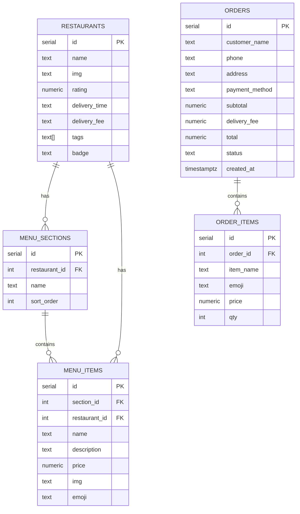
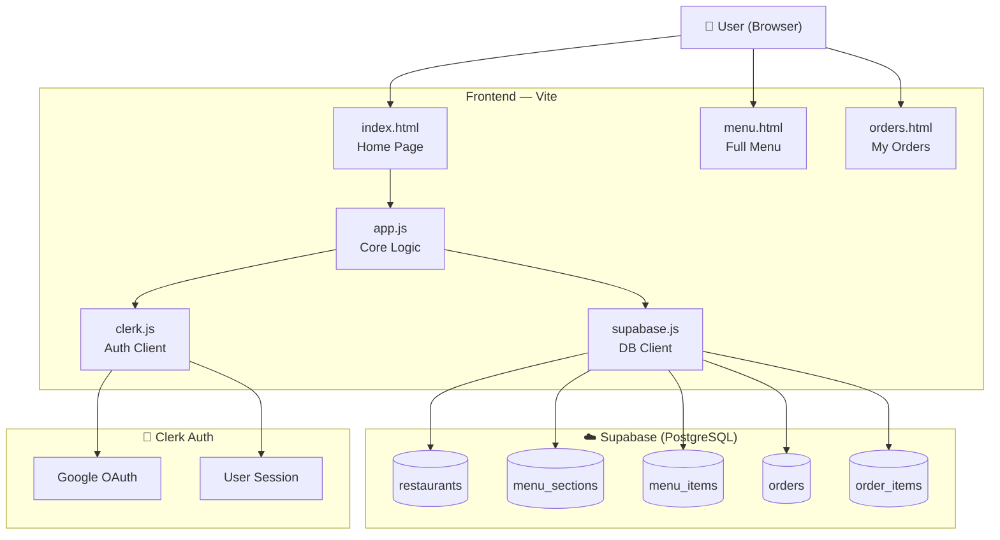
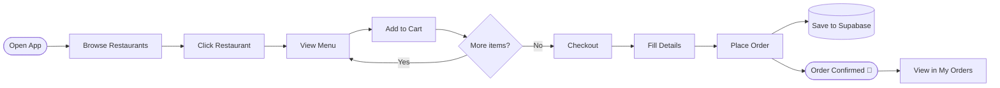

# 🍔 QuickBite — Food Delivery App

A modern food delivery web app built with vanilla HTML/CSS/JS, Vite, Supabase (PostgreSQL), and Clerk authentication.


---

## ✨ Features

- 🍕 Browse restaurants by category (Pizza, Burgers, Sushi, Indian, Mexican, Noodles)
- 🔍 Search dishes and restaurants in real time
- 📋 Full menu page with food photos and prices
- 🛒 Cart with quantity controls and live totals
- 💳 Checkout flow with order summary
- 📦 Orders saved to PostgreSQL via Supabase
- 🗂️ My Orders page — view all past orders
- 🔐 Google authentication via Clerk
- 📱 Fully responsive design

---

## 🛠 Tech Stack

| Layer | Technology |
|-------|-----------|
| Frontend | HTML, CSS, JavaScript (ES Modules) |
| Build tool | Vite |
| Database | PostgreSQL via Supabase |
| Auth | Clerk (Google OAuth) |
| Images | Unsplash |

---

## 🗄️ ER Diagram



---

## 🏗️ System Architecture



---

## 🔄 User Flow



---

## 📁 Project Structure

```
quickbite/
├── index.html          # Home page
├── menu.html           # Full menu page
├── orders.html         # My orders page
├── styles.css          # Global styles
├── menu.css            # Menu page styles
├── app.js              # Core app logic (restaurants, cart, modals)
├── main.js             # Entry point (Supabase + Clerk init)
├── supabase.js         # Supabase client + DB functions
├── clerk.js            # Clerk auth integration
├── menu-page.js        # Menu page logic
├── schema.sql          # Database schema
├── seed.sql            # Seed data
├── fix_rls.sql         # RLS policy fixes
├── vite.config.js      # Vite configuration
├── .env.example        # Environment variable template
└── .gitignore
```

---

## 🚀 Getting Started

### 1. Clone the repo

```bash
git clone https://github.com/YOUR_USERNAME/quickbite.git
cd quickbite
```

### 2. Install dependencies

```bash
npm install
```

### 3. Set up environment variables

```bash
cp .env.example .env
```

Fill in your keys:

```env
VITE_SUPABASE_URL=https://your-project.supabase.co
VITE_SUPABASE_ANON_KEY=your_supabase_anon_key
VITE_CLERK_PUBLISHABLE_KEY=pk_test_your_clerk_key
```

### 4. Set up the database

In your [Supabase SQL Editor](https://supabase.com/dashboard):

1. Run `schema.sql` — creates all tables
2. Run `seed.sql` — populates restaurants and menu items
3. Run `fix_rls.sql` — sets up Row Level Security policies

### 5. Run the dev server

```bash
npm run dev
```

Open [http://localhost:5173](http://localhost:5173)

---

## 🔐 Environment Variables

| Variable | Description |
|----------|-------------|
| `VITE_SUPABASE_URL` | Your Supabase project URL |
| `VITE_SUPABASE_ANON_KEY` | Supabase publishable/anon key |
| `VITE_CLERK_PUBLISHABLE_KEY` | Clerk publishable key |

---

## 📦 Build for Production

```bash
npm run build
```

Output goes to the `dist/` folder.

---

## 🙏 Credits

- Food photos by [Unsplash](https://unsplash.com)
- Database by [Supabase](https://supabase.com)
- Auth by [Clerk](https://clerk.com)
- Build tool by [Vite](https://vitejs.dev)
