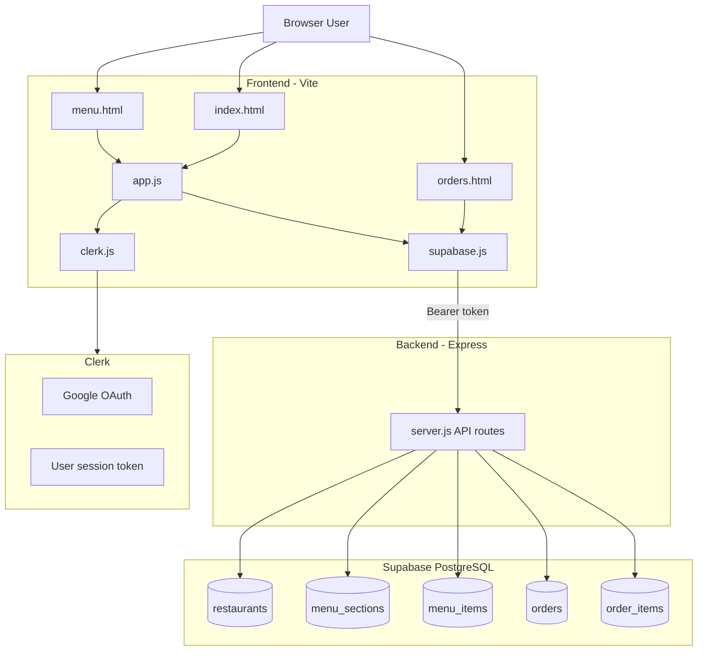
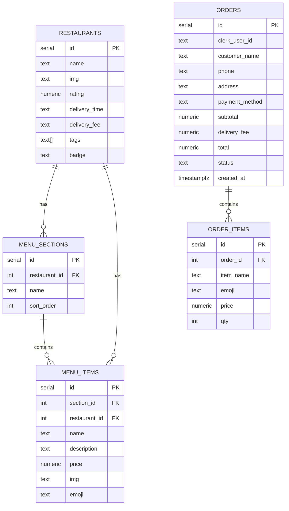
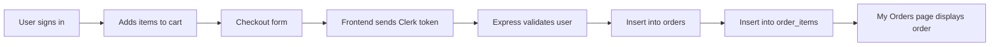

# QuickBite - Food Delivery App

QuickBite is a responsive food delivery web app with restaurant browsing, menu search, cart checkout, Clerk authentication, Supabase-backed orders, INR pricing, and a demo order-tracking experience for Bengaluru.

Live app: [quickbite-indol.vercel.app](https://quickbite-indol.vercel.app)


## Features

- Browse restaurants by category and cuisine.
- Search dishes and restaurants in real time.
- View full menus with food photos, descriptions, and INR prices.
- Add items to cart with quantity controls and live totals.
- Checkout with customer details, payment method, and delivery address.
- Google sign-in powered by Clerk.
- Save authenticated orders to Supabase through an Express API.
- View past orders on the My Orders page.
- Local browser order backup so recent orders still appear if the API is unavailable.
- Demo Track Order section with a timed Bengaluru route that changes to delivered.
- Responsive layout for desktop and mobile.

## Tech Stack

| Area | Technology |
| --- | --- |
| Frontend | HTML5, CSS3, JavaScript ES Modules |
| Build Tool | Vite |
| Backend | Node.js, Express |
| Database | Supabase PostgreSQL |
| Authentication | Clerk Google OAuth |
| API Client | Fetch API |
| Styling | Custom CSS with responsive layouts |
| Deployment | Vercel for frontend, Render-ready backend config |
| Media | Unsplash food images |

## Architecture



## Database Schema



## Project Structure

```text
quickbite/
├── backend/
│   ├── server.js              # Express API, Clerk auth middleware, Supabase writes
│   ├── app.js                 # Backend entry shim
│   ├── package.json
│   └── package-lock.json
├── frontend/
│   ├── index.html             # Home page
│   ├── menu.html              # Menu page
│   ├── orders.html            # Orders and tracking page
│   ├── app.js                 # Restaurants, cart, checkout, modals
│   ├── clerk.js               # Clerk browser integration
│   ├── currency.js            # INR formatting helpers
│   ├── supabase.js            # Frontend API client
│   ├── main.js                # Home entry point
│   ├── menu-main.js           # Menu entry point
│   ├── menu-page.js           # Menu filtering/rendering
│   ├── orders-main.js         # Orders page and tracking demo logic
│   ├── styles.css             # Shared styles
│   ├── menu.css               # Menu-specific styles
│   ├── vite.config.js
│   ├── package.json
│   └── package-lock.json
├── schema.sql                 # Supabase table schema
├── seed.sql                   # Seed restaurant/menu data
├── fix_rls.sql                # RLS policy fixes
├── add_clerk_user_orders.sql  # Clerk user ownership migration
├── render.yaml                # Render deployment blueprint
├── package.json               # Root convenience scripts
└── .env.example               # Environment variable reference
```

## Local Setup

### 1. Clone the Repository

```bash
git clone https://github.com/Aditi-03111/quickbite.git
cd quickbite
```

### 2. Install Dependencies

```bash
npm install
npm --prefix backend install
npm --prefix frontend install
```

### 3. Configure Environment Variables

Create `backend/.env`:

```env
SUPABASE_URL=https://your-project.supabase.co
SUPABASE_SERVICE_KEY=your_supabase_service_role_key
CLERK_SECRET_KEY=sk_test_or_sk_live_your_clerk_secret_key
PORT=3001
```

Create `frontend/.env`:

```env
VITE_API_URL=http://localhost:3001
VITE_CLERK_PUBLISHABLE_KEY=pk_test_your_clerk_key
```

Use the Supabase service role key only on the backend. Never expose it in the frontend.

### 4. Set Up Supabase

In the Supabase SQL Editor, run:

```text
schema.sql
seed.sql
fix_rls.sql
add_clerk_user_orders.sql
```

The `orders` table stores order headers. The `order_items` table stores the food items for each order.

### 5. Run the App Locally

Start the backend:

```bash
npm run dev:backend
```

Start the frontend in a second terminal:

```bash
npm run dev
```

Local URLs:

- Frontend: [http://localhost:5173](http://localhost:5173)
- Backend health check: [http://localhost:3001/api/health](http://localhost:3001/api/health)

## Useful Scripts

From the repo root:

| Command | Description |
| --- | --- |
| `npm run dev` | Start the Vite frontend |
| `npm run dev:backend` | Start the Express backend with watch mode |
| `npm run build` | Build the frontend for production |
| `npm run preview` | Preview the production frontend build |
| `npm run start` | Start the backend |

## API Routes

| Method | Route | Description |
| --- | --- | --- |
| `GET` | `/api/health` | Backend health check |
| `GET` | `/api/restaurants` | Fetch restaurants |
| `GET` | `/api/restaurants/:id/menu` | Fetch menu sections and items for one restaurant |
| `GET` | `/api/menu` | Fetch all menu items |
| `POST` | `/api/orders` | Create an authenticated order |
| `GET` | `/api/orders` | Fetch authenticated user's orders |
| `GET` | `/api/orders/:id` | Fetch one authenticated order |

Protected order routes require a Clerk session token.

## Deployment Notes

### Frontend on Vercel

Set these Vercel environment variables:

```env
VITE_API_URL=https://your-backend-url
VITE_CLERK_PUBLISHABLE_KEY=pk_live_or_pk_test_your_clerk_key
```

The current live frontend is:

[https://quickbite-indol.vercel.app](https://quickbite-indol.vercel.app)

### Backend on Render

The repository includes `render.yaml` for a Render web service named `quickbite-api`.

Set these Render environment variables:

```env
SUPABASE_URL=https://your-project.supabase.co
SUPABASE_SERVICE_KEY=your_supabase_service_role_key
CLERK_SECRET_KEY=sk_live_or_sk_test_your_clerk_secret_key
PORT=3001
```

After deployment, confirm:

```text
https://your-backend-url/api/health
```

If orders appear in the website but not in Supabase, check that `VITE_API_URL` points to the deployed backend and that the backend has valid Supabase and Clerk environment variables.

## Order Flow



The frontend also stores a small local backup of recent orders in `localStorage` so the UI remains responsive if the API is temporarily unavailable.

## Credits

- Food photos from [Unsplash](https://unsplash.com)
- Database and Postgres hosting by [Supabase](https://supabase.com)
- Authentication by [Clerk](https://clerk.com)
- Frontend tooling by [Vite](https://vitejs.dev)
