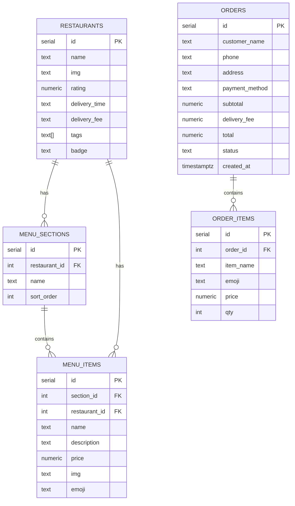
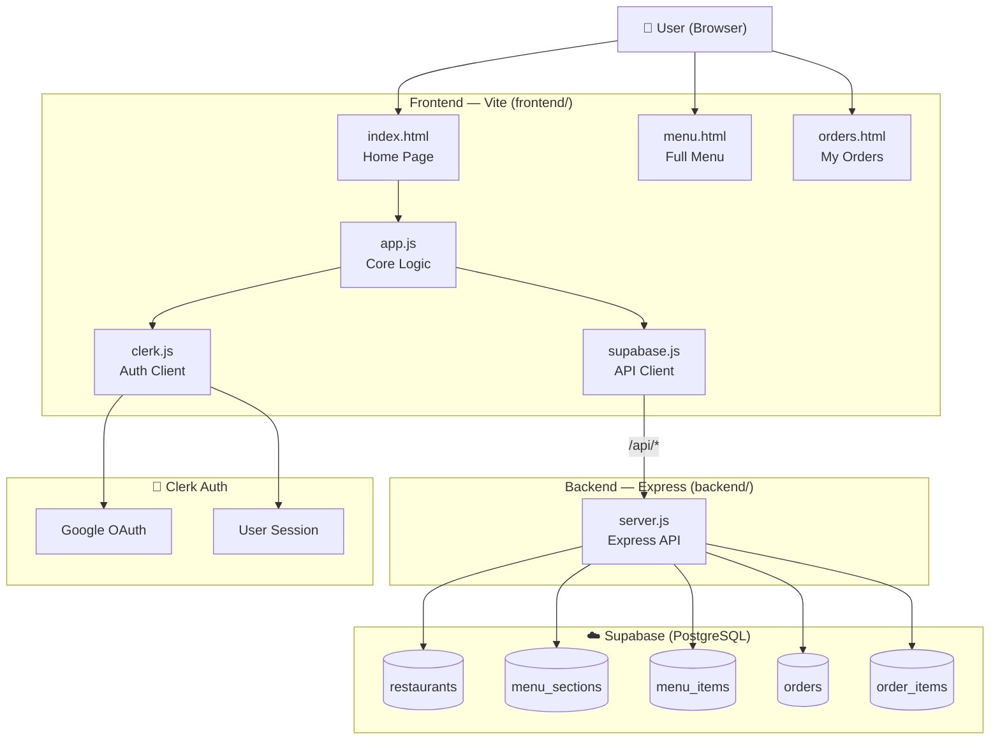
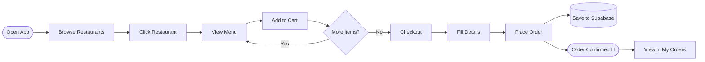

# 🍔 QuickBite — Food Delivery App

A modern food delivery web app built with vanilla HTML/CSS/JS, Vite, Supabase (PostgreSQL), and Clerk authentication.

🌐 Live app: [quickbite-8ajkwlllb-aditi-03111s-projects.vercel.app](https://quickbite-8ajkwlllb-aditi-03111s-projects.vercel.app)


---

## ✨ Features

- 🍕 Browse restaurants by category (Pizza, Burgers, Sushi, Indian, Mexican, Noodles)
- 🔍 Search dishes and restaurants in real time
- 📋 Full menu page with food photos and prices
- 🛒 Cart with quantity controls and live totals
- 💳 Checkout flow with order summary
- 📦 Orders saved to PostgreSQL via Supabase
- 🗂️ My Orders page — view all past orders
- 🔐 Google authentication via Clerk
- 📱 Fully responsive design

---

## 🛠 Tech Stack

| Layer | Technology |
|-------|-----------|
| Frontend | HTML, CSS, JavaScript (ES Modules) |
| Build tool | Vite |
| Database | PostgreSQL via Supabase |
| Auth | Clerk (Google OAuth) |
| Images | Unsplash |

---

## 🗄️ ER Diagram



---

## 🏗️ System Architecture



---

## 🔄 User Flow



---

## 📁 Project Structure

```
quickbite/
├── frontend/               # Vite frontend (HTML/CSS/JS)
│   ├── index.html          # Home page
│   ├── menu.html           # Full menu page
│   ├── orders.html         # My orders page
│   ├── styles.css          # Global styles
│   ├── menu.css            # Menu page styles
│   ├── app.js              # Core app logic (restaurants, cart, modals)
│   ├── main.js             # Entry point (API + Clerk init)
│   ├── supabase.js         # API client (calls Express backend)
│   ├── clerk.js            # Clerk auth integration
│   ├── menu-page.js        # Menu page logic
│   ├── menu-main.js        # Menu page entry point
│   ├── orders-main.js      # Orders page entry point
│   ├── vite.config.js      # Vite configuration (with /api proxy)
│   └── .env                # Frontend env vars (VITE_API_URL, VITE_CLERK_*)
├── backend/                # Express.js API server
│   ├── server.js           # Express server with all API routes
│   ├── package.json        # Backend dependencies
│   └── .env                # Backend env vars (SUPABASE_URL, SUPABASE_SERVICE_KEY)
├── schema.sql              # Database schema
├── seed.sql                # Seed data
├── fix_rls.sql             # RLS policy fixes
├── render.yaml             # Render.com deployment config
├── .env.example            # Environment variable template
└── .gitignore
```

---

## 🚀 Getting Started

### 1. Clone the repo

```bash
git clone https://github.com/YOUR_USERNAME/quickbite.git
cd quickbite
```

### 2. Set up the backend

```bash
cd backend
npm install
```

Copy `.env.example` to `backend/.env` and fill in your Supabase service key:

```env
SUPABASE_URL=https://your-project.supabase.co
SUPABASE_SERVICE_KEY=your_supabase_service_role_key
PORT=3001
```

> ⚠️ Use the **service role key** (not the anon key) — it's secret and stays server-side only.

### 3. Set up the frontend

```bash
cd frontend
npm install
```

Copy `.env.example` to `frontend/.env`:

```env
VITE_API_URL=http://localhost:3001
VITE_CLERK_PUBLISHABLE_KEY=pk_test_your_clerk_key
```

### 4. Set up the database

In your [Supabase SQL Editor](https://supabase.com/dashboard):

1. Run `schema.sql` — creates all tables
2. Run `seed.sql` — populates restaurants and menu items
3. Run `fix_rls.sql` — sets up Row Level Security policies

### 5. Run both servers simultaneously

In one terminal, start the API:

```bash
cd backend && npm run dev
```

In another terminal, start the frontend:

```bash
cd frontend && npm run dev
```

- API runs on [http://localhost:3001](http://localhost:3001)
- Frontend runs on [http://localhost:5173](http://localhost:5173)

The Vite dev server proxies all `/api/*` requests to the backend automatically.

---

## 🔐 Environment Variables

### Backend (`backend/.env`)

| Variable | Description |
|----------|-------------|
| `SUPABASE_URL` | Your Supabase project URL |
| `SUPABASE_SERVICE_KEY` | Supabase **service role** key (secret — never expose to frontend) |
| `PORT` | Port for the Express server (default: 3001) |

### Frontend (`frontend/.env`)

| Variable | Description |
|----------|-------------|
| `VITE_API_URL` | URL of the Express backend (e.g. `http://localhost:3001`) |
| `VITE_CLERK_PUBLISHABLE_KEY` | Clerk publishable key |

---

## 📦 Build for Production

```bash
npm run build
```

Output goes to the `dist/` folder.

---

## 🙏 Credits

- Food photos by [Unsplash](https://unsplash.com)
- Database by [Supabase](https://supabase.com)
- Auth by [Clerk](https://clerk.com)
- Build tool by [Vite](https://vitejs.dev)
